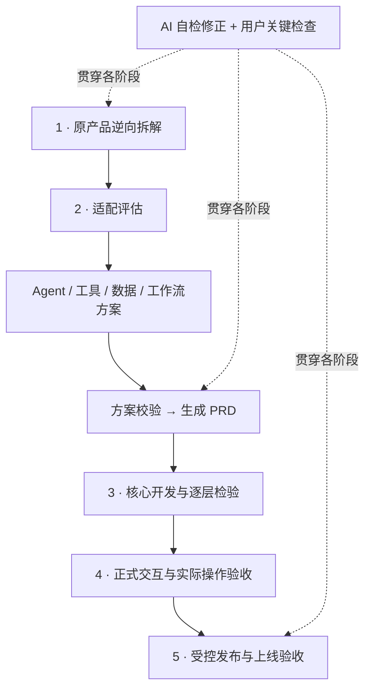

<div align="center">

# Product Lens · 产品透镜

**从真实用户体验，走到可解释的产品机制与可落地的设计。**

An evidence-first skill for product teardown, adaptation, and implementation.

[](LICENSE)
[](skills/product-lens/SKILL.md)

[快速开始](#快速开始) · [五步流程](#五步流程) · [适用场景](#适用场景) · [示例](docs/customer-support-example.md) · [English](README.en.md)

</div>

Product Lens 帮助 AI 沿着用户的实际使用场景，逐环节观察产品、记录证据并反推运行机制。随后结合你的目标和参考蓝图评估适配性，设计 Agent、工具、数据与工作流，**最后生成 PRD**，再按授权推进开发、交互和上线验收。

你可以只做一次用户旅程拆解，也可以从已经核对的结果继续。每个阶段都保留 **AI 自检与用户检验**。

## 五步流程



| 阶段 | AI具体做什么 | 你得到什么 |
|---|---|---|
| **1. 原产品逆向拆解** | 按用户场景试用或逐张回放；结合官方文档；反推职责、工具、数据、状态和交接 | 证据账本、用户旅程、痛点、原产品机制说明、事实/推断/未知清单 |
| **2. 适配与方案 → PRD** | 对照你的目标与蓝图，判断借鉴/改造/舍弃；形成方案并检查后再写PRD | 适配表、职责与I/O契约、工具/数据/工作流方案、架构、PRD与验收计划 |
| **3. 核心开发** | 根据有效方案逐阶段实现，逐层核对真实模型、工具和业务结果 | 核心代码、接口、状态、可操作切片、检查证据 |
| **4. 正式交互** | 在目标终端完善界面、会话或卡片，检验修改、失败和恢复 | 正式交互、接口状态矩阵、浏览器/设备及用户验收记录 |
| **5. 上线交付** | 在授权范围内准备、发布、核对线上业务与恢复能力 | 实际入口、配置与发布记录、权限/数据/恢复检查、使用清单 |

**第一步解释原产品如何工作；第二步决定自己的产品如何做。** 原产品事实、参考框架能力和我们建议的设计始终分开。

## 最重要的工作方式

### 按用户环节取证

提供截图，就按可证实顺序逐张查看；AI直接试用，就在每个环节观察操作前后发生了什么，并保存可定位的观察记录。

| 环节要素 | 必须回答的问题 |
|---|---|
| 场景与目标 | 谁在什么情况下想完成什么？用户习惯有依据还是假设？ |
| 操作 | 输入、点击、选择了什么？操作前是什么状态？ |
| 反馈 | 页面实际出现什么？按钮、错误、结果和状态是否一致？ |
| 决策 | 用户可以怎样继续、修改、退出？实际选择了什么？ |
| 结果 | 数据、业务回执或资产发生什么变化？结果是否真正可用？ |
| 证据 | 对应哪张截图、哪个录屏时间点或真实工具观察位置？ |

使用 `J（用户环节）→ E（事实）→ S（截图或观察记录）` 追溯。缺失过渡保留未知。只读了官方教程属于试用前准备，不能宣称实际试用完成。

### 先适配，再设计，最后写PRD

不是每个原产品功能都值得复现，也不是每个职责都需要一个独立Agent。先检查用户价值、约束与适配条件，再决定由Agent、确定性代码或人负责。17项参考能力逐项取舍，采用数量由真实需求决定。

### 自检之后，仍然保留用户判断

AI先修正能确认的问题，再提交具体结果供用户检查。默认检查旅程、PRD、首个真实业务结果、代表交互、完整交互和上线使用。检查绑定当前范围与产物；没有回复不代表验收通过。

## 适用场景

| 场景 | 拆解重点 |
|---|---|
| AI客服 / 企业知识问答 | 澄清、知识依据、查询、反馈登记、人工交接、问题是否解决 |
| AI图像 / 视频创作 | 输入参考、角色与风格、生成结果、资产引用、修改及一致性 |
| 业务操作 / 流程自动化 | 目标对象、权限、确认、外部写入、幂等、取消与恢复 |
| 数据分析 / 报表产品 | 数据来源、口径、计算过程、结果解释及可复核性 |
| 办公 / 编程助手 | 编辑范围、实际变更、版本、结果可用性与交接 |
| 非AI数字产品 | 用模块、代码和业务规则拆解；没有Agent证据就不虚构Agent |

适合产品经理、独立开发者、AI产品设计者，以及需要把竞品研究转成实现方案的团队。

## 快速开始

### 在Codex中安装

向带有 `skill-installer` 的Codex发送：

```text
使用 $skill-installer 安装这个仓库中的 skill：
https://github.com/jilombmiker-alt/product-lens/tree/main/skills/product-lens
```

安装完成后，在下一轮任务中使用 `$product-lens`。安装方式参见 [Codex skills 目录](https://github.com/openai/skills)。

### 其他支持SKILL.md的工具

下载或克隆仓库，将完整的 `skills/product-lens` 文件夹放入目标工具支持的技能目录。不要只复制SKILL.md，引用资料、模板和检查脚本也需要保留。具体目录与加载方式以目标工具文档为准；本仓库未声明已在所有宿主中实测兼容。

### 先提供四件事

- 产品/模块，以及入口或截图、录屏等材料。
- 目标用户和使用场景；已有习惯依据，没有则标假设。
- 这次想完成的用户任务。
- 本轮结束点：只做旅程、完整逆向拆解、适配方案，还是继续实施。

可从上下文得到的信息无需重复填写。

## 调用示例

**第一步：实际体验与逆向拆解**

```text
使用 $product-lens。
对象：某AI客服。场景：员工查询一项操作规则。
请实际试用，逐环节记录输入、追问、回复、选择与结果，再结合官方文档。
从用户旅程反推它的职责、工具、数据和工作流，区分事实、推断与未知。
先自检修正，再交我核对。本轮只完成第一步。
```

**第二步：根据拆解评估适配，最后生成PRD**

```text
使用 $product-lens。
已确认拆解：<文件位置>。我的目标：<目标用户、场景与限制>。
先判断哪些能力可以借鉴、需要改造或不适配，再对照参考蓝图选择能力。
形成产品板块、Agent/代码职责、工具、数据和工作流方案，校验后最后生成PRD。
本轮不开发。
```

**第三至五步：从有效方案继续**

```text
使用 $product-lens。
PRD和契约：<位置>。已有代码：<位置>。
先检查当前阶段和有效验收，从第一条核心业务闭环开始，逐阶段生成、实现和检验。
本轮只做核心开发；保留首个真实结果的用户验收，不自动部署。
```

没有真实入口时可提交截图回放；只有文档时可以准备试用，但不能据此宣布第一步已完成。更多见[客服教学示例](docs/customer-support-example.md)。

## 可以交付的文件

任务与场景卡、截图/观察索引、证据账本、用户旅程表与图、原产品职责及I/O契约、上下文/状态/资产依赖、适配取舍表、工具与工作流方案、PRD、技术文档、代码和逐层检验、目标终端操作记录、上线交接。

文件可按任务合并，不要求每次生成全部材料。指定单Agent时，可额外生成带证据边界的功能等价System Prompt与测试集。

## 运行条件与边界

- 这是执行方法skill；真实试用、开发和发布依赖宿主提供的浏览器、代码环境、模型、接口与相应权限。
- 不从页面声称还原隐藏思维链、官方System Prompt或未公开后台实现。
- 回复“已完成”、工具成功、业务结果存在、用户目标达成分别验证。
- 模拟测试、真实接口测试和用户验收分开记录。模型配置可用不代表质量达标。
- 不把分析请求自动扩展成购买、对外发送、生产写入、删除或部署。授权与检查点分别处理。
- 账号、密钥、私有原始材料与产品运行数据不随skill上传。

## 验证

Python 3.11+，检查脚本与协议测试仅使用标准库：

```bash
python3 scripts/validate.py
python3 tests/test_handoff.py
```

目前包括文件结构/内部引用检查和 **40项合成交接协议回归**。这些检查不运行真实产品或模型，也不证明完整五步已在生产环境验收。真实skill行为的待测情境见[行为检查清单](skills/product-lens/references/behavior-checks.md)。

## 仓库结构

```text
skills/product-lens/
  SKILL.md             # 统一入口
  agents/openai.yaml   # Codex显示信息
  references/          # 试用、反推、适配、方案、工程与检验规则
  templates/           # 运行卡与交接模板
  scripts/             # 只读交接检查器
scripts/validate.py    # 仓库结构检查
tests/test_handoff.py  # 合成协议回归
docs/                  # 教学示例与参考说明
```

## 参与改进

欢迎通过 [Issues](https://github.com/jilombmiker-alt/product-lens/issues) 提交适配问题，通过Pull Request改进规则。请提供使用场景、最小脱敏输入、实际行为、期望行为和受影响环节；不要上传凭据或无权公开的材料。

## 参考与许可

README组织方式参考了 [Anthropic Skills](https://github.com/anthropics/skills)、[Superpowers](https://github.com/obra/superpowers) 和 [OpenAI Skills](https://github.com/openai/skills) 的项目介绍、工作流与快速开始结构；这些项目不是本仓库的运行依赖。来源边界见[参考说明](docs/REFERENCES.md)。

本仓库文件采用 [MIT License](LICENSE)。外部产品、第三方框架与用户另行提供的资料遵循其各自许可。
